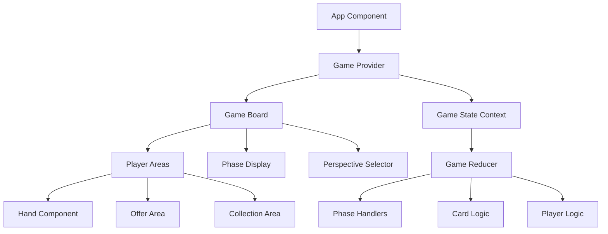

# Design Document: Trading Card Game

## Overview

This design document outlines the architecture for a React-based trading card game featuring a complex 10-phase round system with 3-6 players. The application will use modern React patterns including hooks, context, and reducer patterns to manage the sophisticated game state while providing an intuitive drag-and-drop interface for card interactions.

The game implements a unique buyer-seller mechanic where players rotate through roles, create strategic offers with hidden information, and compete to collect card sets for points. The design emphasizes clean separation of concerns, testable game logic, and flexible UI components that can adapt to different player perspectives.

## Architecture

### High-Level Architecture



### Component Hierarchy

- **App**: Root component with global providers
- **GameProvider**: Context provider for game state management
- **GameBoard**: Main game interface container
  - **PhaseDisplay**: Shows current phase and instructions
  - **PerspectiveSelector**: Dropdown for viewing different player perspectives
  - **PlayerArea** (3-6 instances): Individual player game areas
    - **Hand**: Player's current cards
    - **OfferArea**: 3-card offer display
    - **CollectionArea**: Accumulated cards and points
  - **GameControls**: Phase advancement and action buttons

### State Management Strategy

The application will use React's `useReducer` hook combined with Context API for centralized state management. This approach provides:

- **Predictable state updates** through reducer actions
- **Complex state logic** handling for multi-phase gameplay
- **Easy testing** of game logic through pure reducer functions
- **Performance optimization** through selective context subscriptions

### Future Client/Server Architecture Considerations

The current design is structured to facilitate future migration to a client/server model with minimal changes:

**Current Architecture Benefits for Client/Server Migration**:
- **Pure reducer functions**: Game logic is already separated from UI, making it easy to move to server
- **Action-based state updates**: Actions can be serialized and sent over network
- **Immutable state patterns**: State snapshots can be efficiently synchronized
- **Perspective-based rendering**: UI already handles viewing game from different player perspectives

**Design Patterns Supporting Migration**:
- **Centralized state management**: All game state in single reducer makes server state management straightforward
- **Event-driven architecture**: Actions map directly to server events/messages
- **Stateless UI components**: Components receive props and dispatch actions, easily adaptable to remote state
- **Validation separation**: Game rule validation in reducer can be moved to server

**Recommended Additions for Easier Migration**:
1. **Action serialization**: Ensure all actions contain only serializable data
2. **State synchronization hooks**: Design state updates to be atomic and conflict-free
3. **Network abstraction layer**: Prepare action dispatching to work through network layer
4. **Player authentication**: Add player ID tracking to all actions
5. **Game session management**: Structure state to support multiple concurrent games

The current React patterns (hooks, context, reducers) will support the transition well, as the UI layer can remain largely unchanged while the state management layer is adapted to communicate with a server instead of local reducers.

## Components and Interfaces

### Core Game State Interface

```typescript
interface GameState {
  // Game Configuration
  players: Player[]
  currentBuyerIndex: number
  currentPhase: GamePhase
  currentPlayerIndex: number
  round: number
  
  // Card Management
  drawPile: Card[]
  discardPile: Card[]
  
  // Action Phase Done System
  actionPhaseDoneStates: boolean[] // Array indexed by player ID, true if player is done
  
  // UI State
  selectedPerspective: number
  phaseInstructions: string
  autoFollowPerspective: boolean
  
  // Game Status
  winner: number | null
  gameStarted: boolean
}

interface Player {
  id: number
  name: string
  hand: Card[]
  offer: OfferCard[]
  collection: Card[]
  points: number
  hasMoney: boolean
}

interface Card {
  id: string
  type: 'thing' | 'gotcha' | 'action'
  subtype: string
  name: string
  setSize: number
  effect?: string
}

interface OfferCard extends Card {
  faceUp: boolean
  position: number // 0, 1, or 2
}

enum GamePhase {
  BUYER_ASSIGNMENT = 'buyer_assignment',
  DEAL = 'deal',
  OFFER_PHASE = 'offer_phase',
  BUYER_FLIP = 'buyer_flip',
  ACTION_PHASE = 'action_phase',
  OFFER_SELECTION = 'offer_selection',
  OFFER_DISTRIBUTION = 'offer_distribution',
  GOTCHA_TRADEINS = 'gotcha_tradeins',
  THING_TRADEINS = 'thing_tradeins',
  WINNER_DETERMINATION = 'winner_determination'
}
```

### Game Actions Interface

```typescript
type GameAction = 
  | { type: 'START_GAME'; players: string[] }
  | { type: 'ADVANCE_PHASE' } // Now handles automatic progression through administrative phases
  | { type: 'PLACE_OFFER'; playerId: number; cards: Card[]; faceUpIndex: number }
  | { type: 'FLIP_CARD'; offerId: number; cardIndex: number }
  | { type: 'PLAY_ACTION_CARD'; playerId: number; cardId: string }
  | { type: 'SELECT_OFFER'; buyerId: number; sellerId: number } // Now automatically progresses through offer distribution
  | { type: 'CHANGE_PERSPECTIVE'; playerId: number }
  | { type: 'DECLARE_DONE'; playerId: number }
```

### Automatic Phase Progression

The game implements intelligent automatic progression through administrative phases that require no strategic player decisions:

**Automatic Transitions:**
1. **BUYER_ASSIGNMENT → DEAL → OFFER_PHASE**: Automatic in all rounds (first and subsequent)
2. **OFFER_DISTRIBUTION → GOTCHA_TRADEINS**: Automatic always
3. **SELECT_OFFER action**: Automatically handles offer distribution phase

**Implementation Details:**
- **ADVANCE_PHASE action**: Enhanced to handle automatic progression chains
- **SELECT_OFFER action**: Modified to automatically progress through offer distribution
- **Consistent behavior**: Works the same way in first round and all subsequent rounds
- **No manual intervention**: Players never need to click through administrative phases

### Card Component Interface

```typescript
interface CardProps {
  card: Card
  displayState: 'face_up' | 'face_down' | 'partial'
  draggable?: boolean
  onClick?: () => void
  onDragStart?: (card: Card) => void
  className?: string
}
```

### Player Area Component Interface

```typescript
interface PlayerAreaProps {
  player: Player
  isCurrentPlayer: boolean
  isBuyer: boolean
  perspective: number
  phase: GamePhase
  onCardPlay: (card: Card) => void
  onOfferPlace: (cards: Card[], faceUpIndex: number) => void
}
```

## Data Models

### Deck Composition

The game uses a fixed deck of 120 cards:

**Thing Cards (65 total)**:
- Giant Thing: 4 cards (1 card = 1 point)
- Big Thing: 16 cards (2 cards = 1 point)  
- Medium Thing: 25 cards (3 cards = 1 point)
- Tiny Thing: 20 cards (4 cards = 1 point)

**Gotcha Cards (32 total)**:
- Gotcha Once: 10 cards
- Gotcha Twice: 10 cards  
- Gotcha Bad: 12 cards

**Action Cards (23 total)**:
- Flip One: 5 cards
- Add One: 6 cards
- Remove One: 6 cards
- Remove Two: 3 cards
- Steal A Point: 3 cards

### Card Display Logic

Cards have three visual states based on game rules and player perspective:

1. **Face Up**: Full card information visible
   - All collection cards
   - Face up offer cards
   - Own hand cards (from own perspective)

2. **Face Down**: Generic card back shown
   - Other players' hand cards
   - Face down offer cards (from other perspectives)

3. **Partial**: Hybrid display showing card info but indicating hidden status
   - Own face down offer cards (from own perspective)
   - Shows card name/type but with visual indicator of face down status

### Player Rotation Logic

The game implements clockwise player rotation with automatic skipping:

- **Standard rotation**: Buyer → Player to Buyer's right → ... → Player to Buyer's left
- **Buyer-excluded phases**: Start with player to Buyer's right
- **Auto-skip conditions**: Players with no valid actions are automatically skipped
- **Action phase special case**: Only players who are not done participate in rotation; when any action card is played, all players with action cards are marked as not done and can participate again

## Correctness Properties

*A property is a characteristic or behavior that should hold true across all valid executions of a system—essentially, a formal statement about what the system should do. Properties serve as the bridge between human-readable specifications and machine-verifiable correctness guarantees.*

Based on the prework analysis, the following properties have been identified as testable through property-based testing:

### Deck and Game Initialization Properties

**Property 1: Deck composition correctness**
*For any* newly created deck, the total count should be exactly 65 Thing cards, 32 Gotcha cards, and 23 Action cards
**Validates: Requirements 1.1**

**Property 2: Thing card distribution**
*For any* newly created deck, Thing cards should contain exactly 4 Giant, 16 Big, 25 Medium, and 20 Tiny cards
**Validates: Requirements 1.2**

**Property 3: Gotcha card distribution**
*For any* newly created deck, Gotcha cards should contain exactly 10 Once, 10 Twice, and 12 Bad cards
**Validates: Requirements 1.3**

**Property 4: Action card distribution**
*For any* newly created deck, Action cards should contain exactly 5 Flip One, 6 Add One, 6 Remove One, 3 Remove Two, and 3 Steal A Point cards
**Validates: Requirements 1.4**

**Property 5: Deck shuffling**
*For any* two newly created and shuffled decks, they should have different card orders (with high probability)
**Validates: Requirements 1.5**

**Property 6: Player count validation**
*For any* game initialization attempt, it should succeed only when player count is between 3 and 6 inclusive
**Validates: Requirements 2.1**

**Property 7: Random buyer selection**
*For any* set of players across multiple game starts, each player should have a chance to be selected as the initial buyer
**Validates: Requirements 2.2**

**Property 8: Player area initialization**
*For any* started game, each player should have an offer area, collection area, and empty hand
**Validates: Requirements 2.3, 2.4**

### Phase Management Properties

**Property 9: Phase sequence correctness**
*For any* game round, phases should execute in the exact order: Buyer assignment, Deal, Offer phase, Buyer-flip phase, Action phase, Offer selection, Offer distribution, Gotcha trade-ins, Thing trade-ins, Winner determination
**Validates: Requirements 3.1**

**Property 10: Phase transition automation**
*For any* completed phase, the game should automatically advance to the next phase in sequence
**Validates: Requirements 3.3**

**Property 11: Phase action validation**
*For any* player action attempt, it should be rejected if attempted outside the appropriate phase
**Validates: Requirements 3.4**

**Property 12: Game continuation until winner**
*For any* game state without a clear winner, the game should continue to the next round
**Validates: Requirements 3.5**

### Deal Phase Properties

**Property 13: Hand replenishment**
*For any* deal phase execution, all players should end with exactly 5 cards in hand
**Validates: Requirements 4.1**

**Property 14: Sequential dealing**
*For any* deal phase, cards should be dealt one at a time to each player in sequence
**Validates: Requirements 4.2**

**Property 15: Deck reshuffling**
*For any* deal phase when draw pile is empty, the discard pile should become the new shuffled draw pile
**Validates: Requirements 4.3**

### Offer Phase Properties

**Property 16: Offer card count**
*For any* seller's offer, it should contain exactly 3 cards from their hand
**Validates: Requirements 5.1**

**Property 17: Offer face up/down distribution**
*For any* seller's offer, it should have exactly 2 face down cards and 1 face up card
**Validates: Requirements 5.2**

**Property 18: Offer immutability**
*For any* placed offer, attempts to modify it should be rejected
**Validates: Requirements 5.3**

**Property 19: Phase advancement condition**
*For any* offer phase, advancement to buyer-flip should occur only when all sellers have completed offers
**Validates: Requirements 5.5**

### Buyer-Flip Phase Properties

**Property 20: Buyer flip permissions**
*For any* buyer-flip phase, only the buyer should be able to flip cards, and only one card total
**Validates: Requirements 6.1, 6.3**

**Property 21: Card flip state change**
*For any* flipped card, its state should change from face down to face up
**Validates: Requirements 6.2**

**Property 22: Phase advancement after flip**
*For any* card flip action, the phase should advance to Action phase
**Validates: Requirements 6.5**

### Action Phase Properties

**Property 23: Action card play permissions**
*For any* player with action cards in collection who is not done, they should be able to play them during action phase
**Validates: Requirements 7.1**

**Property 24: Multiple action card play**
*For any* player with multiple action cards who is not done, they should be able to play multiple cards in sequence
**Validates: Requirements 7.2**

**Property 25: Action card restriction**
*For any* player without action cards in collection or who is done, they should be unable to play action cards
**Validates: Requirements 7.3**

**Property 26: Immediate effect execution**
*For any* played action card, its effects should be applied immediately
**Validates: Requirements 7.4**

**Property 27: Action phase done state initialization**
*For any* action phase start, players with no action cards should be marked as done (checked and disabled), and players with action cards should be marked as not done (unchecked and enabled)
**Validates: Requirements 8.1**

**Property 28: Done state reset on action card play**
*For any* action card played, all players who still have action cards should be automatically marked as not done (unchecked)
**Validates: Requirements 8.3**

**Property 29: Automatic done state for depleted players**
*For any* player who plays an action card and has no more action cards remaining, they should be automatically marked as done (checked and disabled)
**Validates: Requirements 8.4**

**Property 30: Player rotation restriction**
*For any* action phase rotation, only players who are not done should be included in the rotation
**Validates: Requirements 7.5**

**Property 31: Action phase termination conditions**
*For any* action phase, it should end when all players are marked as done
**Validates: Requirements 8.5**

### Offer Selection and Distribution Properties

**Property 32: Single offer selection**
*For any* offer selection phase, the buyer should be able to select exactly one seller's offer
**Validates: Requirements 9.1**

**Property 33: Money bag transfer**
*For any* offer selection, the money bag should transfer from buyer to the selected seller
**Validates: Requirements 9.2**

**Property 34: Selected offer distribution**
*For any* selected offer, it should move to the buyer's collection
**Validates: Requirements 9.3**

**Property 35: Non-selected offer return**
*For any* non-selected offers, they should return to their respective sellers' collections
**Validates: Requirements 9.4**

**Property 36: Offer area cleanup**
*For any* offer distribution completion, all offer areas should be empty
**Validates: Requirements 9.5**

### Trade-in Properties

**Property 37: Gotcha set identification**
*For any* player collection, all complete Gotcha sets should be correctly identified
**Validates: Requirements 10.1**

**Property 38: Automatic Gotcha trade-ins**
*For any* complete Gotcha sets in collections, they should be automatically traded in
**Validates: Requirements 10.2**

**Property 39: Thing set identification**
*For any* player collection, all complete Thing sets should be correctly identified
**Validates: Requirements 10.3**

**Property 40: Thing set point calculation**
*For any* complete Thing sets, points should be awarded correctly (1 Giant=1pt, 2 Big=1pt, 3 Medium=1pt, 4 Tiny=1pt)
**Validates: Requirements 10.4**

**Property 41: Point total updates**
*For any* trade-in completion, player point totals should be updated correctly
**Validates: Requirements 10.5**

### Gotcha Card Effect Properties

**Property 42: Gotcha Once card selection**
*For any* player trading in a set of 2 Gotcha Once cards, the buyer should be able to select exactly one card from that player's collection
**Validates: Requirements 21.1**

**Property 43: Gotcha Once steal or discard choice**
*For any* Gotcha Once effect, the buyer should be able to choose independently whether to steal the selected card or discard it
**Validates: Requirements 21.2, 21.3, 21.4**

**Property 44: Gotcha Once insufficient cards handling**
*For any* Gotcha Once effect when the player has fewer cards than required, the buyer should be required to select all remaining cards in the collection
**Validates: Requirements 21.5**

**Property 45: Gotcha Twice card selection**
*For any* player trading in a set of 2 Gotcha Twice cards, the buyer should be able to select exactly two cards from that player's collection
**Validates: Requirements 22.1**

**Property 46: Gotcha Twice independent choices**
*For any* Gotcha Twice effect, the buyer should be able to choose independently for each card whether to steal it or discard it
**Validates: Requirements 22.2, 22.3, 22.4, 22.5**

**Property 47: Gotcha Bad point penalty**
*For any* player trading in a set of 3 Gotcha Bad cards, that player should lose one point if they have at least one point
**Validates: Requirements 23.1, 23.2**

**Property 48: Gotcha Bad point transfer**
*For any* Gotcha Bad effect where the affected player is not the buyer and loses a point, the buyer should receive that point
**Validates: Requirements 23.3**

**Property 49: Gotcha Bad buyer self-effect**
*For any* Gotcha Bad effect where the affected player is the buyer, the lost point should be discarded without awarding it to anyone
**Validates: Requirements 23.4**

**Property 50: Gotcha Bad immediate processing**
*For any* Gotcha Bad effect, point transfers should be processed immediately when effects are applied
**Validates: Requirements 23.5**

**Property 51: Buyer own collection discard requirement**
*For any* Gotcha Once or Gotcha Twice effect where the buyer affects their own collection, all selected cards should be discarded
**Validates: Requirements 24.2**

**Property 52: Buyer self-steal prevention**
*For any* Gotcha effect where the buyer affects their own collection, the buyer should be prevented from stealing cards from their own collection
**Validates: Requirements 24.3**

**Property 53: Gotcha set self-selection prevention**
*For any* Gotcha effect, the Gotcha sets cannot select themselves since they are discarded before effects are applied
**Validates: Requirements 24.5**

**Property 54: Money bag token transfer timing**
*For any* offer selection phase, the money bag token should transfer to the selected seller while the buyer role remains unchanged for the current round
**Validates: Requirements 25.1, 25.2**

**Property 55: Buyer role transition timing**
*For any* buyer assignment phase, the buyer role should transfer to the player holding the money bag from the previous round
**Validates: Requirements 25.3**

**Property 56: Buyer privilege continuity**
*For any* round, all buyer-specific mechanics should use the current round's buyer until the next buyer assignment phase
**Validates: Requirements 25.5**

**Property 57: Iterative Gotcha processing**
*For any* Gotcha trade-in phase, the system should continue processing Gotcha sets until no complete Gotcha sets remain in any player's collection
**Validates: Requirements 26.1, 26.2, 26.3**

**Property 58: Gotcha completion verification**
*For any* transition from Gotcha trade-ins to Thing trade-ins, no complete Gotcha sets should exist in any player's collection
**Validates: Requirements 26.4**

**Property 59: Gotcha iteration completeness**
*For any* Gotcha processing iteration, all available Gotcha sets should be processed before checking for newly formed sets
**Validates: Requirements 26.5**

**Property 60: Gotcha processing order**
*For any* Gotcha processing iteration, Gotcha sets should be processed in the order: Gotcha Bad first, then Gotcha Twice, then Gotcha Once
**Validates: Requirements 26.6**

**Property 81: Automatic buyer assignment to offer phase progression**
*For any* ADVANCE_PHASE action from BUYER_ASSIGNMENT phase, the game should automatically progress through DEAL to OFFER_PHASE in all rounds
**Validates: Requirements 42.1**

**Property 82: Automatic deal to offer phase progression**
*For any* ADVANCE_PHASE action from DEAL phase, the game should automatically progress to OFFER_PHASE with cards dealt
**Validates: Requirements 42.2**

**Property 83: Automatic offer distribution progression**
*For any* SELECT_OFFER action, the game should automatically progress through OFFER_DISTRIBUTION to GOTCHA_TRADEINS
**Validates: Requirements 42.3**

**Property 84: Automatic offer distribution phase advancement**
*For any* ADVANCE_PHASE action from OFFER_DISTRIBUTION phase, the game should automatically progress to GOTCHA_TRADEINS
**Validates: Requirements 42.4**

**Property 85: Consistent automatic progression across rounds**
*For any* round (first or subsequent), automatic phase progression should work identically
**Validates: Requirements 42.5**

### Winner Determination Properties

**Property 61: Win condition checking**
*For any* winner determination phase, players with 5+ points should be identified
**Validates: Requirements 27.1**

**Property 61: Tie handling**
*For any* scenario with tied players for most points, the game should continue to next round
**Validates: Requirements 27.2**

**Property 62: Winner declaration**
*For any* scenario with one player having 5+ points and more than others, that player should be declared winner
**Validates: Requirements 27.3**

**Property 63: Game end state**
*For any* declared winner, no further gameplay actions should be allowed
**Validates: Requirements 27.5**

### Player Rotation Properties

**Property 65: Clockwise rotation order**
*For any* multi-player phase, player turns should proceed clockwise starting from buyer
**Validates: Requirements 29.1**

**Property 66: Buyer-excluded rotation**
*For any* phase where buyer doesn't act, rotation should start with player to buyer's right
**Validates: Requirements 29.2**

**Property 67: Rotation wraparound**
*For any* rotation reaching the last player, it should continue with the first player
**Validates: Requirements 29.3**

**Property 68: Automatic player skipping**
*For any* player with no valid actions in current phase, they should be automatically skipped
**Validates: Requirements 30.1, 30.2, 30.3**

**Property 69: Complete rotation coverage**
*For any* phase requiring player actions, rotation should continue until all eligible players have had opportunity
**Validates: Requirements 30.5**

### Perspective and Display Properties

**Property 70: Perspective independence**
*For any* perspective change, the current acting player should remain unchanged
**Validates: Requirements 31.2**

**Property 71: Card display updates**
*For any* perspective selection, all card displays should update according to that player's view
**Validates: Requirements 31.3**

**Property 72: Perspective switching availability**
*For any* game phase, perspective switching should be allowed
**Validates: Requirements 31.4**

**Property 73: Card display states**
*For any* card, it should be displayable in face up, face down, and partial states
**Validates: Requirements 32.1**

**Property 74: Own hand visibility**
*For any* player viewing their own perspective, their hand cards should be face up
**Validates: Requirements 32.2**

**Property 75: Other hand privacy**
*For any* player viewing other players' hands, those cards should be face down
**Validates: Requirements 32.3**

**Property 76: Collection visibility**
*For any* perspective, all collection cards should be face up
**Validates: Requirements 32.4**

**Property 77: Offer card visibility**
*For any* offer viewing, face down cards should be partial for owner's perspective and face down for others
**Validates: Requirements 32.5**

**Property 78: Partial card content**
*For any* partial card display, it should show card name and description in the top half
**Validates: Requirements 33.1**

**Property 79: Partial display conditions**
*For any* card display, partial state should be used only for player's own face down offer cards from their perspective
**Validates: Requirements 33.3**

**Property 80: Automatic perspective following**
*For any* active player change, the selected perspective should automatically update to match the new active player
**Validates: Requirements 36.1, 36.2**

## Error Handling

The application will implement comprehensive error handling for:

### Game State Errors
- Invalid player counts (< 3 or > 6 players)
- Attempts to perform actions in wrong phases
- Invalid card plays or moves
- Corrupted game state recovery

### UI Interaction Errors
- Drag and drop failures
- Network connectivity issues (future multiplayer)
- Browser compatibility problems
- Invalid perspective selections

### Card Logic Errors
- Insufficient cards for dealing
- Invalid offer compositions
- Set identification failures
- Point calculation errors

### Error Recovery Strategies
- **Graceful degradation**: Continue gameplay when possible
- **State validation**: Verify game state consistency before critical operations
- **User feedback**: Clear error messages for invalid actions
- **Logging**: Comprehensive error logging for debugging

## Testing Strategy

The testing approach combines unit tests for specific scenarios with property-based tests for universal correctness guarantees.

### Property-Based Testing
- **Framework**: Use Jest with fast-check library for property-based testing
- **Test configuration**: Minimum 100 iterations per property test
- **Coverage**: All 80 correctness properties will be implemented as property tests
- **Tagging**: Each test tagged with format: **Feature: trading-card-game, Property {number}: {property_text}**

### Unit Testing
- **Component testing**: React Testing Library for UI component behavior
- **Game logic testing**: Specific scenarios and edge cases
- **Integration testing**: Phase transitions and complex interactions
- **Error condition testing**: Invalid inputs and edge cases

### Test Organization
```
src/
├── __tests__/
│   ├── components/
│   │   ├── Card.test.tsx
│   │   ├── PlayerArea.test.tsx
│   │   └── GameBoard.test.tsx
│   ├── game-logic/
│   │   ├── deck.test.ts
│   │   ├── phases.test.ts
│   │   └── player-rotation.test.ts
│   └── properties/
│       ├── deck-properties.test.ts
│       ├── phase-properties.test.ts
│       ├── offer-properties.test.ts
│       └── display-properties.test.ts
```

### Testing Priorities
1. **Core game logic**: Deck creation, phase management, card movement
2. **Player interactions**: Offers, card plays, perspective switching
3. **Edge cases**: Insufficient cards, tie scenarios, error conditions
4. **UI behavior**: Card display states, drag and drop, responsive design

The dual testing approach ensures both specific functionality works correctly (unit tests) and universal properties hold across all possible inputs (property tests), providing comprehensive coverage for this complex game system.

<function_calls>
<invoke name="prework">
<parameter name="featureName">trading-card-game